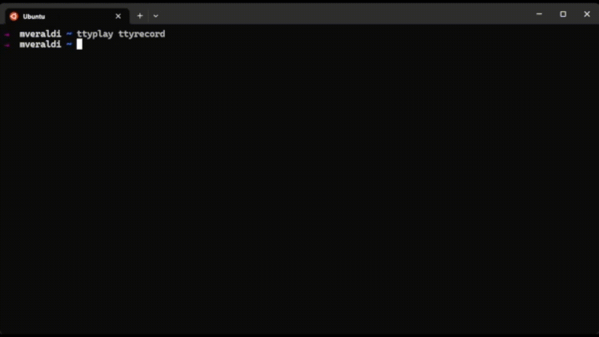

# Committer CLI
This command line interface helps developers to create meaningful commit messages.
Its implementation follows the [Conventional Commits Specification](https://www.conventionalcommits.org/en/v1.0.0/).

## Why should I care that much about "commit messages"?
In a DevOps team that focuses on continuous delivery, a clean and explicit tree of commits is necessary for having complete control of your application developing state over time.

Think about the last medium/big-sized project you worked on: imagine that today your tester found a bug related to a feature created more than six months ago and maintained ever since -- how would you track down all the meaningful changes to see where the problem is? How would you know precisely how, why, and when that bug occurred?

There are multiple tools and techniques to address this problem, and they all come down to understanding what one or more Commits changed on the codebase. And what is the first thing you see to understand what a commit did to the codebase? The message.

In theory, the message should be meaningful enough to let you understand what the code modification did to the application and all the details: like breaking changes, assumptions, etc.

Conventional Commits Specification defined some guidelines to create effective commit messages, and this CLI helps you to do so.

## How to install
Type "npm i -g @mattveraldi/conventional-commits" to install this package globally, then type "committer" to start the CLI.